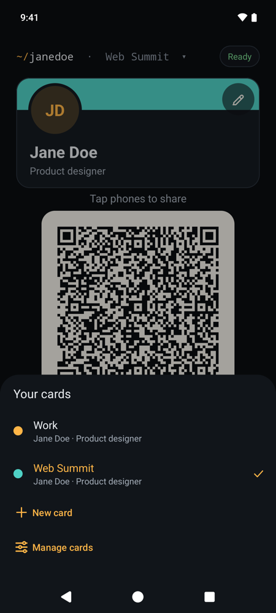
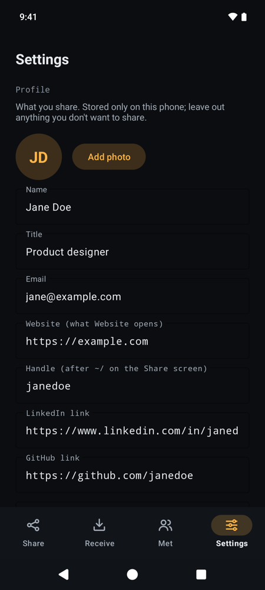
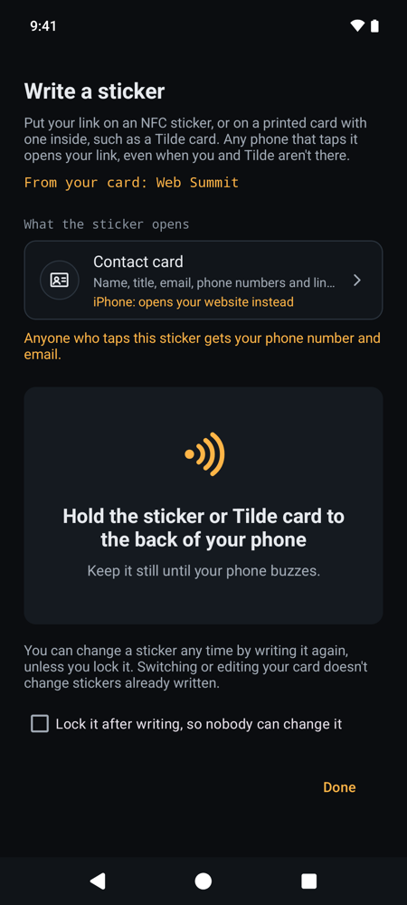
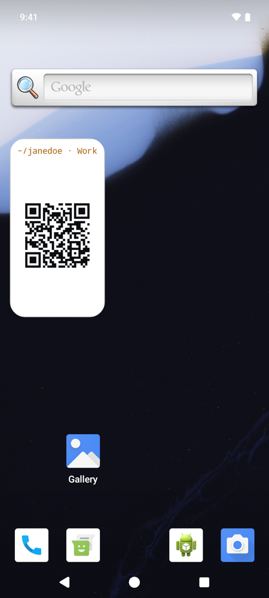
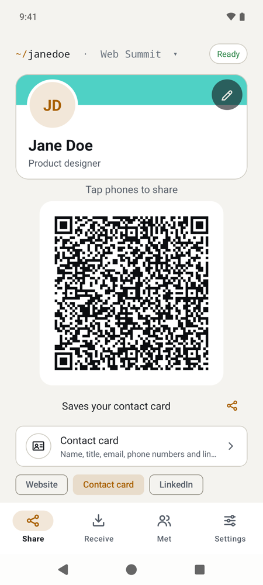
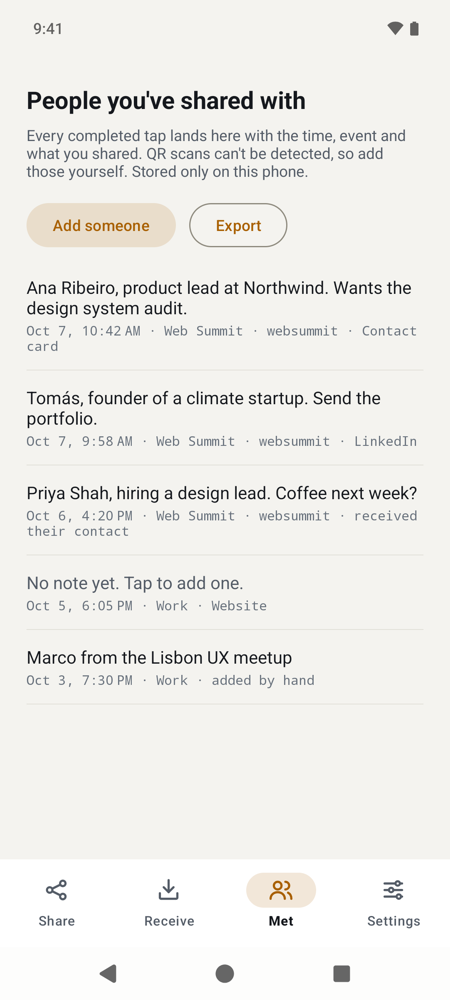
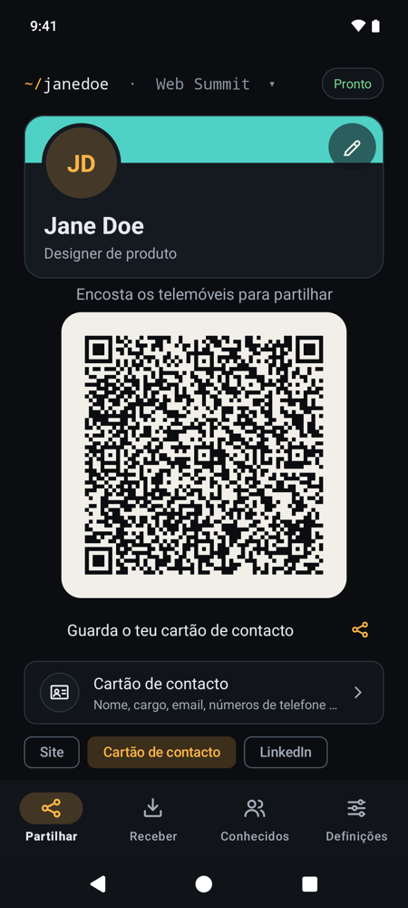
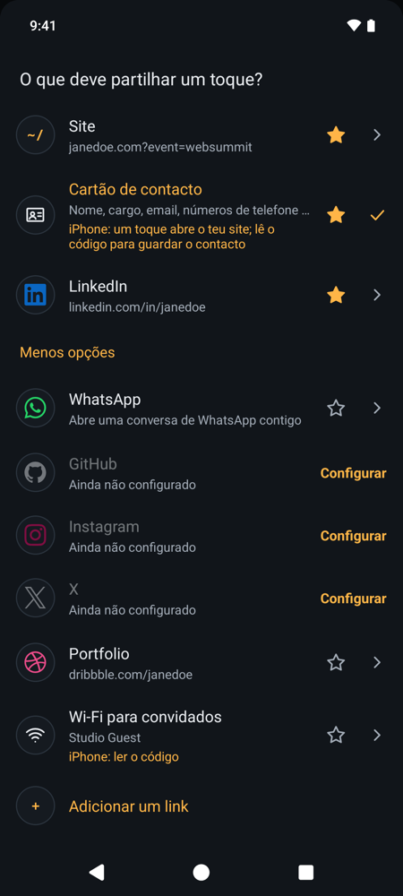
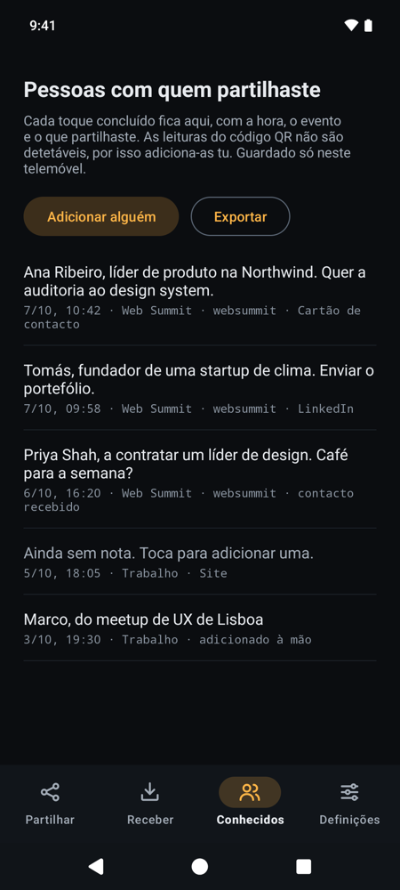

# Tilde

**Your business card, on your phone.** Hold your Android phone against someone else's and they get
your website, contact details, WhatsApp or LinkedIn, just as if you'd handed them an NFC business
card. Or they scan the code on your screen.

**Free and open source** (MIT licence). Website: [tbutman.com/tilde](https://tbutman.com/tilde). No account, sign-up, subscription, payment or ads, and no
internet: Tilde can't go online, and your details stay on your phone until you share them.

<p>
  
  
  
</p>

<details>
<summary>More screenshots</summary>
<p>
  
  
  
  
  
  
  
  
  
</p>
</details>

## What it does

- **More than one card.** Keep a card for work, one for personal life, one for a project or an
  event, each with its own name, title, company, photo, links and colour. Swipe your card (or tap
  `~/` at the top) to switch; only you see the labels.
- **Tap to share.** The other phone doesn't need Tilde or any other app. Phones read it the way they
  read an NFC sticker or a contactless business card.
- **Or scan.** The same thing is on screen as a large QR code, for phones without NFC or people
  who'd rather scan.
- **Switch what you share in one tap,** to suit who you're talking to: tap one of the chips under
  the QR code (or swipe the code), or tap the line below them for every option:
  - **Contact card:** your name, title, company, phone numbers, email, website and social links all
    at once, ready to save to their contacts. (It's the standard format every phone's contacts app
    understands.)
  - **A link:** your website, LinkedIn, GitHub, Instagram, X, or links you save yourself, such as
    your projects. Each saved link is its own option, with its own name.
  - **WhatsApp:** opens a chat with you, with a greeting typed and ready to send.
  - **Guest Wi-Fi:** joins your network without anyone typing the password. The password isn't
    written on screen, but the Wi-Fi code contains it: anyone who scans it or taps your phone can
    join. It's shared once: after a tap, or when you leave the Share screen, your card goes back to
    what it shared before.
- **Choose what each card gives away.** Leave your phone number off an event card, for
  example; taps, the code and Send all follow it.
- **Send it instead.** For someone who isn't in front of you, send the link or your contact card
  through WhatsApp, email or messages, or copy the link. Tilde stays offline: the app you choose
  does the sending.
- **Remember who you met.** Every tap is listed under **Met** with the time, which card and what you
  shared. Add a note so you remember who they were, and export the list as a spreadsheet (CSV).
  Met keeps everyone unless you choose to delete entries older than 3, 6 or 12 months.
- **Events.** Add an **event name** and the links to your own website carry it, so you can see
  which event a visit came from. It clears itself at the end of the day, unless you switch that off.
- **Write a sticker.** Put your link or your whole contact card on an NFC sticker, or on a Tilde
  card with one inside, so it works even when your phone isn't there. You can change it later,
  unless you tick **Lock it after writing** so nobody can overwrite it.
- **Receive.** Read other people's NFC business cards, stickers and phones with Tilde open.
- **Home-screen widget.** The **Tilde QR code** widget puts a card's QR code on your home screen,
  for sharing by code in a second.
- **Back up to a file and move phones.** Save your cards, photos, Met and settings to a file you
  keep, and restore it on a new phone (the first welcome screen offers **Restore a backup**). No
  cloud, no account.
- **Dark or light, English or Portuguese** (European).

## Install

Tilde isn't in the Play Store yet, so you install it from this page. It takes about a minute and
you **don't** need developer mode or any special settings: Android just asks you twice to confirm.

Tilde needs Android 8.0 or newer. Tapping phones needs NFC; the QR code works on any phone.

1. **Download it.** On your Android phone, open the
   [latest release](https://github.com/tbutman/tilde/releases/latest) and, under **Assets**, tap
   the file ending in `.apk`. If your browser warns that this type of file can harm your device,
   tap **Download anyway**: it says that about every app downloaded outside the Play Store.
2. **Let your browser install apps (once).** Open the downloaded file. Android says your browser
   isn't allowed to install unknown apps: tap **Settings**, turn on **Allow from this source**, then
   go back.
3. **Install it.** Tap **Install**. Google Play Protect may say it doesn't recognise the developer,
   because Tilde isn't in the Play Store: choose to install anyway (on some phones that's under
   **More details**). If it offers to scan the app first, that's fine too.
4. **Open Tilde** and follow the welcome screens.

The exact wording of these prompts varies a little between phones and Android versions.

**Is it safe?** Every release is built from this code by GitHub Actions and signed with the same
key, and Android only installs an update over Tilde if it's signed with that key, so nobody else can
replace your copy. Tilde has no internet permission, so it can't send your details anywhere. To
check a download yourself (for example with [AppVerifier](https://github.com/soupslurpr/AppVerifier)),
the package is `com.tbutman.tilde` and the signing certificate's SHA-256 fingerprint is:

```
84:5F:25:41:BD:70:77:34:EC:97:76:23:90:BE:B1:0B:9D:0A:5C:64:AF:0D:B4:27:A6:94:99:86:73:A0:38:D9
```

### Updates

- **Automatically:** install [Obtainium](https://obtainium.imranr.dev), tap **Add app** and enter
  `https://github.com/tbutman/tilde`. It checks for new versions and offers to install them.
- **By hand:** repeat steps 1 and 3 with the new version. It installs over the old one and keeps
  your card and everything else.

## Using it

1. Open Tilde. The Share screen is what the other person sees.
2. Hold the backs of the two phones together for a second or two. Their phone shows your link or
   your contact card. Tilde buzzes and shows **Sent** once it's been read.
3. Tap a chip, or the row under your code, to change what a tap shares.

Things worth knowing:

- **Keep Tilde open while you share.** By default Tilde only answers taps while it's on screen, so
  nothing is shared from your pocket by accident. To share with Tilde closed (screen on, phone
  unlocked), switch on Settings → Sharing → Answer taps when Tilde is closed. The Quick Settings
  tile and the home-screen widget open it in one swipe.
- **The Share screen goes to full brightness and stays on, and Tilde buzzes when a tap is read.**
  Settings → Sharing turns off full brightness, keeping the screen on, or the buzz.
- **iPhones only act on links from a tap.** If you share your contact card, a tapping iPhone opens
  your website instead; the QR code saves the contact on any phone. Guest Wi-Fi is the same: an
  iPhone joins by scanning the code. The Share screen tells you when this applies.
- **The other phone needs NFC switched on.** Most Android phones have it in Quick Settings. iPhones
  read without any setting.

## Optional: the Tilde card

Tilde works on its own; you don't need a card. If you have a 3D printer and want something to hand
out too, the **Tilde card** is a free, open-source business card designed to go with it: a QR code
on the front, and optionally an NFC sticker sealed inside. Customise it with your name and colours,
print it, then use **Settings → Write a sticker** to put your link or contact card on the sticker.
See [tbutman/tilde-card](https://github.com/tbutman/tilde-card).

## Privacy

Tilde only asks for NFC and vibration. It has no internet permission, so it can't send anything
anywhere: no analytics, no ads, no accounts. Your cards, photos and Met list are stored only on
your phone, and Tilde opts out of Android's cloud backup. A tap or the QR code never includes
your photo; a contact card you **Send** includes it only if you switch that on (Settings →
Sharing). A backup file holds everything unencrypted, so keep it somewhere private. **Delete all
data** (Settings → About), or uninstalling, removes everything from the phone.

More detail: [tbutman.com/tilde/privacy](https://tbutman.com/tilde/privacy).

## Questions

**The other phone doesn't react.** Check that NFC is on for both phones, that Tilde is open on
screen with **Share by tap** on (Settings → Sharing), and try moving the phones slowly: the NFC
antenna is usually near the camera or in the middle of the back. Thick or metal cases can block it.

**Can I use it without NFC?** Yes. The QR code shows the same thing and works with any camera.

**Is there an iPhone version?** No. iPhones don't let apps answer NFC taps the way Tilde does, so
Tilde is Android only. iPhones can read from it, though.

## Development

Tilde is written in Kotlin with no network code and few dependencies. See
[docs/DEVELOPMENT.md](docs/DEVELOPMENT.md) for how it works, building, tests and releases, and
[CHANGELOG.md](CHANGELOG.md) for what's changed.

## Contributing

Bug reports and ideas are welcome in [Issues](https://github.com/tbutman/tilde/issues). For code,
open an issue first; see [docs/DEVELOPMENT.md](docs/DEVELOPMENT.md) to build and test.

## Licence

[MIT](LICENSE) © Thomas Butman.

The site logos (WhatsApp, LinkedIn, GitHub, Instagram, X, and the sites saved links can point to,
such as Bluesky, YouTube or Calendly) come from [Simple Icons](https://simpleicons.org) (CC0) and are
used only next to links to your own pages. They remain their owners' trademarks.
