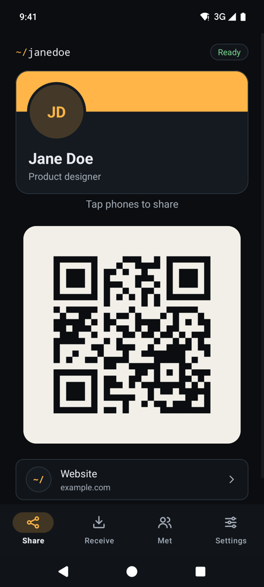
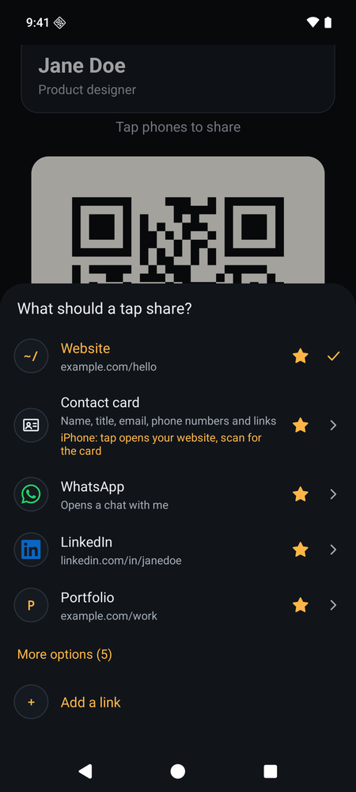
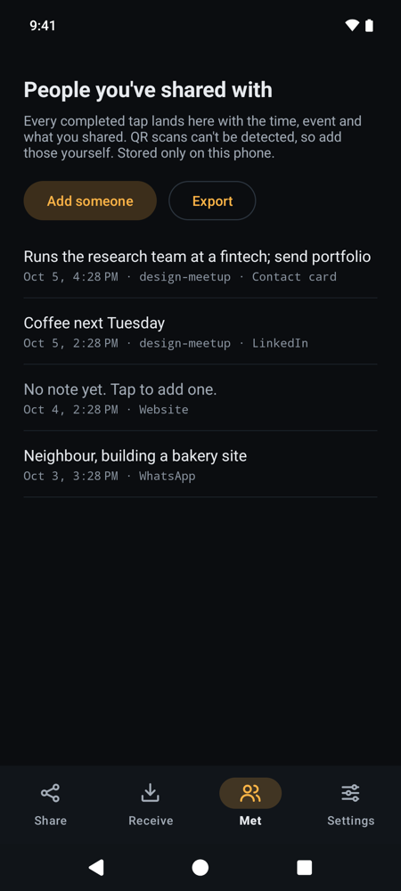

# Tilde

**Your business card, on your phone.** Hold your Android phone against someone else's and they get
your website, contact details, WhatsApp or LinkedIn, just as if you'd handed them an NFC business
card. Or they scan the code on your screen.

**Free and open source** (MIT licence). No account, sign-up, subscription, payment or ads, and no
internet: Tilde can't go online, and your details stay on your phone until you share them.

  
  
  

## What it does

- **Tap to share.** The other phone doesn't need Tilde or any other app. Phones read it the way they
  read an NFC tag.
- **Or scan.** The same thing is on screen as a large QR code, for phones without NFC or people
  who'd rather scan.
- **Switch what you share in one tap,** to suit who you're talking to. Tap the line under the QR
  code and pick:
  - **Contact card:** your name, title, phone numbers, email, website and social links all at once,
    ready to save to their contacts. (It's a vCard, the standard format every phone's contacts app
    understands.)
  - **A link:** your website, LinkedIn, GitHub, Instagram, X, or any link you like.
  - **WhatsApp:** opens a chat with you, with a greeting typed and ready to send.
  - **Guest Wi-Fi:** joins your network without anyone typing the password.
- **Remember who you met.** Every tap is listed under **Met** with the time and what you shared.
  Add a note so you remember who they were, and export the list as a spreadsheet (CSV).
- **Events.** Add an event name and the links to your own website carry it, so you can see which
  event a visit came from.
- **Write a card.** Put your link or your whole contact card on an NFC sticker or a printed NFC
  business card, so it works even when your phone isn't there. Tilde never locks a tag, so you can
  change it later.
- **Receive.** Read other people's NFC cards, tags and phones running Tilde.

## Install

Tilde is for Android 8.0 or newer. Tapping needs a phone with NFC; the QR code works on any phone.

1. On your Android phone, open [Releases](https://github.com/tbutman/tilde/releases) and, under the
   newest version, tap the file ending in `.apk` to download it.
2. Open the downloaded file. Android will ask whether your browser may install apps: allow it, go
   back and tap **Install**.
3. Open Tilde, fill in your card and tap **Create my card**.

Tilde isn't on the Play Store yet. To get updates automatically, install
[Obtainium](https://obtainium.imranr.dev) and add `https://github.com/tbutman/tilde` as an app.

## Using it

1. Open Tilde. The Share screen is what the other person sees.
2. Hold the backs of the two phones together for a second or two. Their phone shows your link or
   your contact card. Tilde buzzes and shows **Sent** once it's been read.
3. Tap the line under the QR code to change what a tap shares.

Things worth knowing:

- **Keep Tilde open while you share.** Some other apps also answer NFC taps, and Android only gives
  Tilde priority while it's on screen. A Quick Settings tile (in Settings) opens it in one swipe.
- **iPhones only act on links from a tap.** If you share your contact card, a tapping iPhone opens
  your website instead; the QR code saves the contact on any phone. Guest Wi-Fi is the same: an
  iPhone joins by scanning the code. The Share screen tells you when this applies.
- **The other phone needs NFC switched on.** Most Android phones have it in Quick Settings. iPhones
  read without any setting.

## Optional: a printed card

Tilde works on its own; you don't need a card. If you have a 3D printer and want something to hand
out too, there's a free, open-source business card designed to go with it: a QR code on the front,
and optionally an NFC tag sealed inside. Customise it with your name and colours, print it, then
use **Settings → Write a card** to put your link or contact card on the tag. See
[tbutman/tilde-card](https://github.com/tbutman/tilde-card).

## Privacy

Tilde only asks for NFC and vibration. It has no internet permission, so it can't send anything
anywhere: no analytics, no ads, no accounts. Your profile, photo and the Met list are stored only
on your phone, and Tilde opts out of Android's cloud backup, so they aren't copied to Google either.
Your photo is never shared; it only appears on your own screen. Uninstalling Tilde deletes
everything.

## Questions

**The other phone doesn't react.** Check that NFC is on for both phones, that Tilde is open on
screen, and try moving the phones slowly: the NFC antenna is usually near the camera or in the
middle of the back. Thick or metal cases can block it.

**Can I use it without NFC?** Yes. The QR code shows the same thing and works with any camera.

**Is there an iPhone version?** No. iPhones don't let apps act as an NFC tag, so Tilde is Android
only. iPhones can read from it, though.

## Development

Tilde is written in Kotlin with no network code and few dependencies. See
[docs/DEVELOPMENT.md](docs/DEVELOPMENT.md) for how it works, building, tests and releases, and
[CHANGELOG.md](CHANGELOG.md) for what's changed.

## Licence

[MIT](LICENSE) © Thomas Butman.

The WhatsApp, LinkedIn, GitHub, Instagram and X logos come from [Simple Icons](https://simpleicons.org)
(CC0) and are used only to link to your own accounts. They remain their owners' trademarks.
